# 🔐 Intelligent File Backup & Management System

> **A Linux-based intelligent file management system for automated backup, real-time monitoring, file classification, duplicate detection, and future AI-based analysis.**


---

## 🎯 Project Objective

Build a **local, offline Linux system** that automatically:

* 💾 Performs full and incremental backups
* 👀 Monitors file activity in real time
* 🗂️ Classifies files by type
* 📅 Filters files based on modification date
* 👻 Ignores hidden files
* ⭐ Supports important project folders
* ♻️ Detects duplicate and redundant files
* 🤖 Provides AI-based analysis in future phases

The project is being developed incrementally, starting with the **core Linux backup system in C** and gradually adding deduplication, database support, and AI capabilities.

### Development Phases

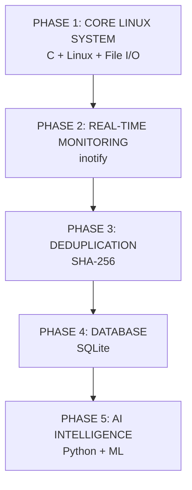

### Current Status

| Phase                           | Status      |
| ------------------------------- | ----------- |
| Core Backup System              | ✅ Completed |
| File Filtering & Classification | ✅ Completed |
| Incremental Backup              | ✅ Completed |
| Real-Time Monitoring            | ✅ Completed |
| SHA-256 Deduplication           | 🔜 Next     |
| SQLite Integration              | 🔜 Planned  |
| AI Analysis                     | 🔜 Planned  |

---

# 🏗️ System Architecture

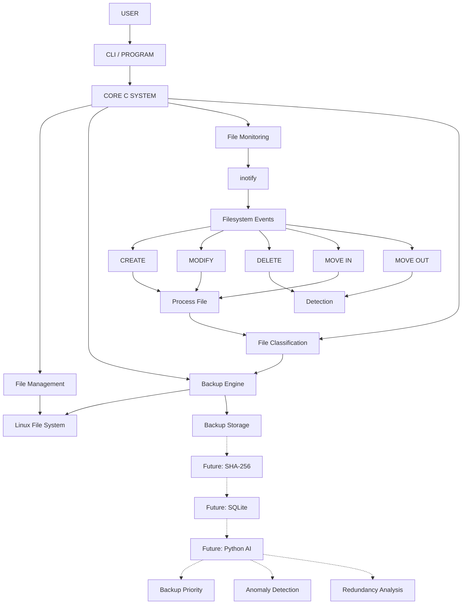

---

# ⚙️ Core Modules

| Module                 | Function                                      |
| ---------------------- | --------------------------------------------- |
| 📁 File Manager        | Handles directory and file operations         |
| 💾 Full Backup         | Performs the initial backup                   |
| 🔄 Incremental Backup  | Backs up only new or modified files           |
| 👀 Monitoring          | Detects filesystem changes using `inotify`    |
| 🗂️ Classification     | Categorizes files by extension                |
| 👻 Hidden File Filter  | Skips hidden files                            |
| 📅 Date Filter         | Processes files based on modification date    |
| 📦 File Copy           | Copies files using low-level Linux I/O        |
| ⭐ Project Registry     | Planned support for important project folders |
| ♻️ Duplicate Detection | Planned SHA-256 based duplicate detection     |
| 🗄️ SQLite             | Planned metadata storage                      |
| 🤖 AI Layer            | Planned intelligent analysis                  |

---

# 💾 Backup Flow

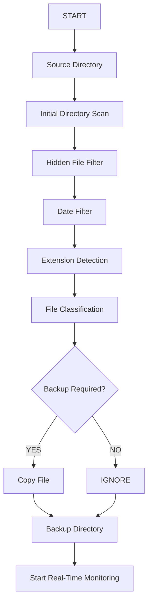

### Backup Types

| Type                   | Description                                        |
| ---------------------- | -------------------------------------------------- |
| **Full Backup**        | Copies all eligible files during the initial scan  |
| **Incremental Backup** | Copies only new or modified files                  |
| **Real-Time Backup**   | Automatically processes relevant filesystem events |
| **Restore**            | 🔜 Planned future feature                          |

---

# 👀 Real-Time File Monitoring

The system uses Linux **`inotify`** to monitor the source directory for filesystem changes.

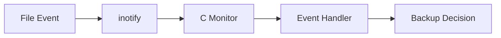

### Monitored Events

```text
CREATE
MODIFY
DELETE
MOVE IN
MOVE OUT
```

### Event Handling

| Event           | Current Action            |
| --------------- | ------------------------- |
| `IN_CREATE`     | Process and backup file   |
| `IN_MODIFY`     | Process and update backup |
| `IN_MOVED_TO`   | Process and backup file   |
| `IN_DELETE`     | Detect and display event  |
| `IN_MOVED_FROM` | Detect and display event  |

> Currently, DELETE and MOVE OUT are **detection-only events**. The corresponding backup is not automatically removed.

---

# 🗂️ File Classification

Files are categorized according to their extensions.

| Extension               | Category      |
| ----------------------- | ------------- |
| `.pdf`, `.PDF`          | PDF Document  |
| `.doc`, `.docx`         | Word Document |
| `.ppt`, `.pptx`         | Presentation  |
| `.xls`, `.xlsx`         | Spreadsheet   |
| `.jpg`, `.jpeg`, `.png` | Image         |
| `.xml`                  | XML / Data    |
| Other / No Extension    | Other         |

### Classification Flow

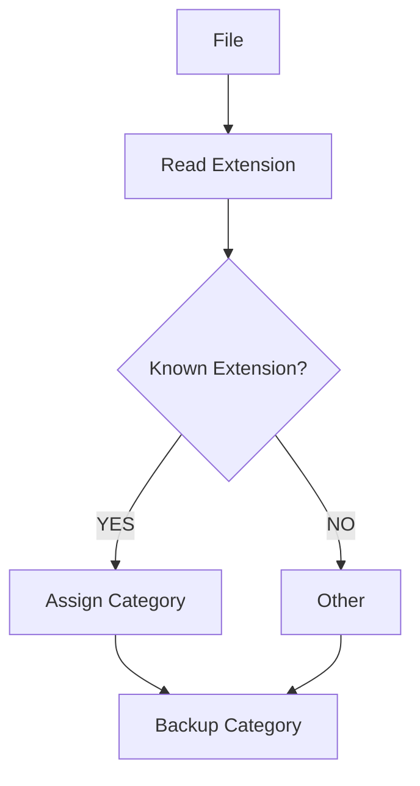

The current implementation uses:

```c
strrchr()
```

to find the file extension and:

```c
strcmp()
```

to identify the appropriate category.

---

# 📅 Date Filtering

The system allows the user to provide a **minimum modification date**.

```text
YYYY-MM-DD
```

Only files modified on or after the selected date are processed.

### Example

```text
Selected Date: 2026-09-09

old.pdf      → 2026-09-01 → SKIPPED
report.pdf   → 2026-09-09 → BACKED UP
new.jpg      → 2026-09-10 → BACKED UP
```

The file modification time is obtained using:

```c
stat()
```

---

# 👻 Hidden File Filtering

Hidden files are ignored during processing.

The system checks whether the filename starts with:

```c
.
```

Example:

```text
.hidden.txt
.secret.pdf
.config
```

Result:

```text
SKIPPED: .hidden.txt (Hidden File)
```

---

# ⭐ Project Folder Registry

Important project folders can be given special treatment in the future.

Example:

```text
/home/user/Projects/OS_Project
/home/user/Projects/Final_Year_Project
```

| Setting          | Planned Value |
| ---------------- | ------------- |
| Priority         | HIGH          |
| Backup Frequency | HIGH          |
| Monitoring       | ENABLED       |

> ⭐ Project-folder prioritization is part of the planned intelligent layer and is not currently used by the core `main.c` implementation.

---

# ♻️ Duplicate Detection

The next major feature is **content-based duplicate detection**.

Exact duplicate files will be identified using **SHA-256 hashes**.

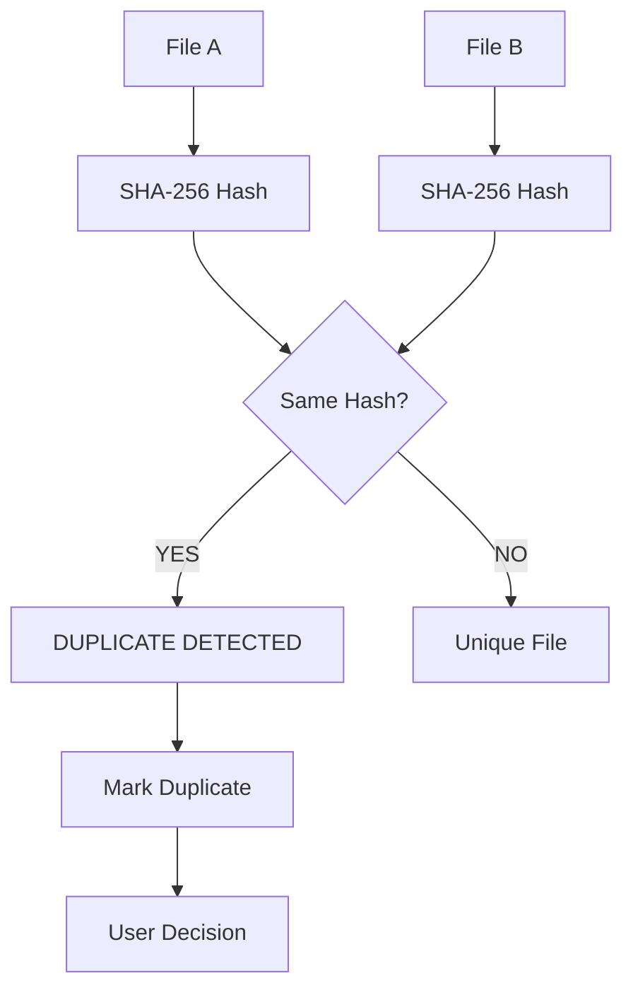

Example:

```text
report.pdf
report_copy.pdf
```

If:

```text
SHA-256(report.pdf)
        =
SHA-256(report_copy.pdf)
```

the files can be identified as duplicates.

> ⚠️ Files will not be automatically deleted. Duplicate files will first be identified for user review.

---

# 📏 Rule-Based Backup Decision

The current backup system uses predefined rules before introducing AI.

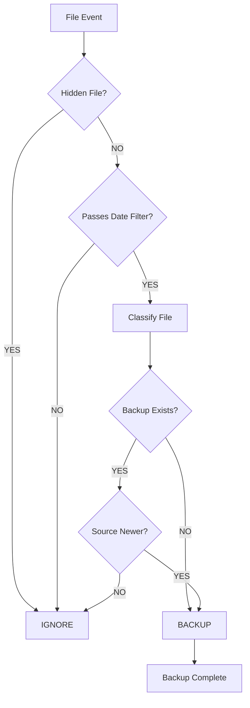

### Current Rules

```text
IF file is hidden
        ↓
Ignore

IF file fails date filter
        ↓
Ignore

IF file has valid category
        ↓
Classify

IF backup does not exist
        ↓
Backup

IF source is newer than backup
        ↓
Update Backup

IF source is unchanged
        ↓
Ignore
```

---

# 🤖 AI Layer

The AI layer will be added **after the core backup, monitoring, deduplication, and database systems are functional**.

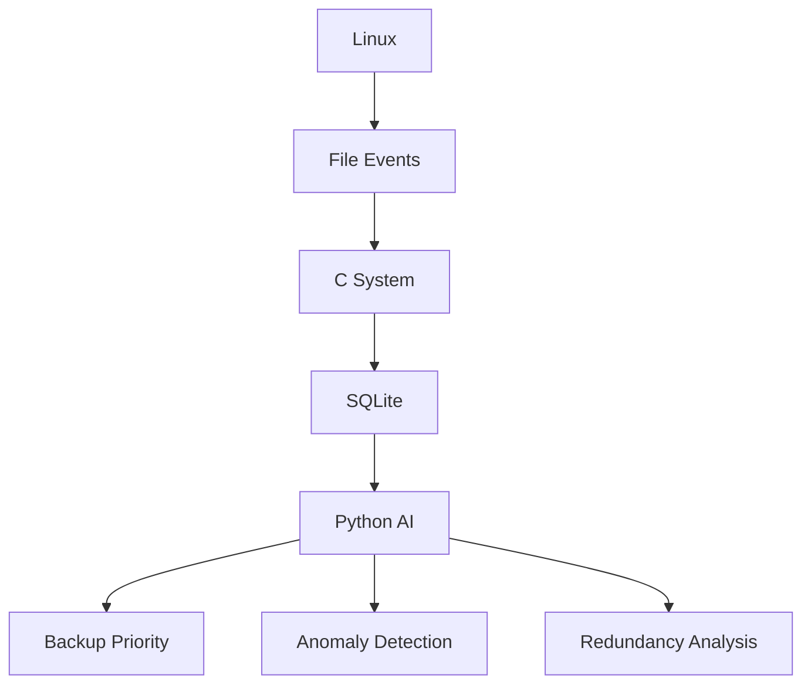

### AI Features

| Feature                | Purpose                              |
| ---------------------- | ------------------------------------ |
| 🧠 Backup Priority     | Identify important files             |
| 🚨 Anomaly Detection   | Detect unusual file activity         |
| ♻️ Redundancy Analysis | Identify potentially redundant files |

> 🤖 These AI features are **planned**, not part of the current core implementation.

---

# 🧠 Intelligent Backup Priority

The future AI system can analyze:

* File modification frequency
* File usage frequency
* Last modification time
* Project-folder status
* File type
* Previous backup history

### Example

```text
main.c

Modification Frequency: HIGH
Project Folder: YES
Recent Activity: HIGH

Result:
Importance = HIGH
Backup Priority = HIGH
```

---

# 🚨 Anomaly Detection

The future AI layer can identify unusual filesystem activity.

### Normal Activity

```text
20–30 file changes/day
Regular modifications
Normal activity pattern
```

### Potentially Unusual Activity

```text
Hundreds of files modified rapidly
Large number of file changes
Unusual activity pattern
```

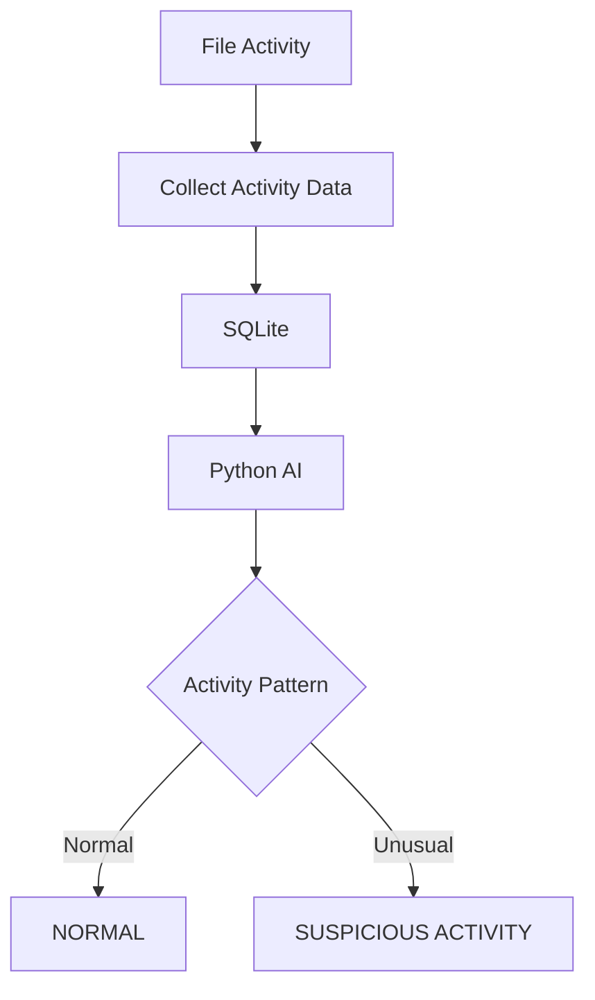

Output:

```text
NORMAL
   OR
SUSPICIOUS ACTIVITY
```

---

# ♻️ Smart Redundancy Analysis

The future AI system can analyze:

```text
Similar file names
File age
File type
Usage frequency
SHA-256 hash
Content similarity (future)
```

Example:

```text
report_final.pdf
report_final_copy.pdf
report_final_v2.pdf
```

These files can be flagged as **potentially redundant** for user review.

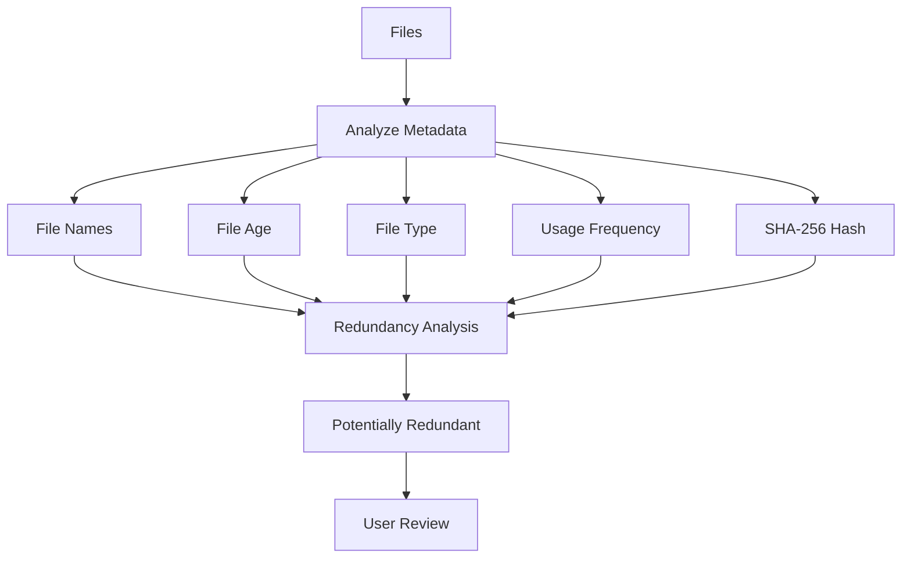

---

# 🛠️ Technology Stack

### Current

| Component          | Technology                                  |
| ------------------ | ------------------------------------------- |
| Operating System   | Linux / Ubuntu                              |
| Environment        | WSL                                         |
| Core Language      | C                                           |
| Compiler           | GCC                                         |
| Linux Integration  | POSIX / Linux System Calls                  |
| File Monitoring    | `inotify`                                   |
| Directory Handling | `opendir()` / `readdir()`                   |
| File Metadata      | `stat()`                                    |
| File I/O           | `open()` / `read()` / `write()` / `close()` |
| Interface          | Command Line                                |
| Version Control    | Git / GitHub                                |

### Planned

| Component        | Technology     |
| ---------------- | -------------- |
| Hashing          | SHA-256        |
| Database         | SQLite         |
| AI Language      | Python         |
| Machine Learning | Scikit-learn   |
| Data Processing  | Pandas / NumPy |

---

# 📂 Project Structure

### Current Structure

```text
intelligent-file-backup-system/
│
├── main.c
├── README.md
│
└── test_files/
```

### Planned Structure

```text
intelligent-file-backup-system/
│
├── src/
│   ├── main.c
│   ├── file_manager/
│   ├── backup/
│   ├── monitoring/
│   └── deduplication/
│
├── database/
│   ├── schema.sql
│   └── system.db
│
├── ai/
│   ├── backup_priority.py
│   ├── anomaly_detection.py
│   └── redundancy_analysis.py
│
├── backups/
├── test_files/
│
├── README.md
└── Makefile
```

### Architecture Overview

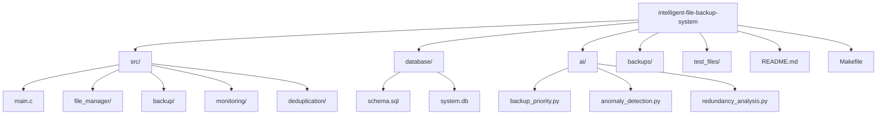

---

# 📊 Evaluation Metrics

| Metric              | Objective                          |
| ------------------- | ---------------------------------- |
| Backup Size         | Reduce unnecessary storage         |
| Backup Time         | Reduce backup time                 |
| Restore Time        | Enable fast recovery               |
| I/O Overhead        | Minimize unnecessary I/O           |
| Detection Time      | Detect changes quickly             |
| Duplicate Detection | Correctly identify duplicate files |
| Anomaly Detection   | Identify unusual activity          |

### Full vs Incremental Backup

| Feature      | Full Backup        | Incremental Backup |
| ------------ | ------------------ | ------------------ |
| Files Copied | All eligible files | New / Modified     |
| Storage      | High               | Lower              |
| Time         | Higher             | Lower              |
| I/O          | High               | Optimized          |

---

# 🔄 Complete System Flow

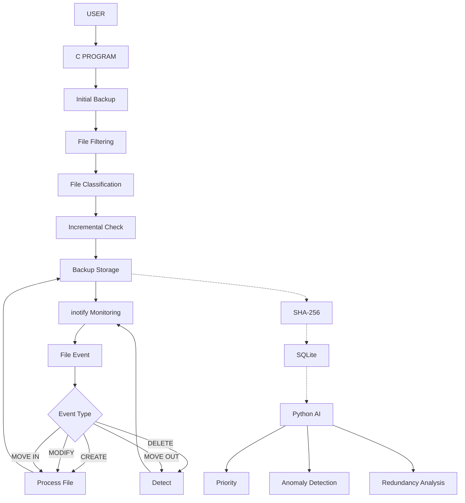

```text
USER
 │
 ▼
C PROGRAM
 │
 ▼
Initial Backup
 │
 ├──→ File Filtering
 │
 ├──→ File Classification
 │
 └──→ Incremental Check
          │
          ▼
     Backup Storage
          │
          ▼
    inotify Monitoring
          │
          ▼
      File Event
          │
    ┌─────┼─────┐
    ▼     ▼     ▼
 CREATE MODIFY MOVE IN
    │     │     │
    └─────┼─────┘
          ▼
      Process File

DELETE / MOVE OUT
          │
          ▼
       Detect

Future:
Backup Storage
      │
      ▼
   SHA-256
      │
      ▼
   SQLite
      │
      ▼
  Python AI
      │
 ┌────┼────────────┐
 ▼    ▼            ▼
Priority  Anomaly  Redundancy
```

---

# 🔗 Overall System Pipeline

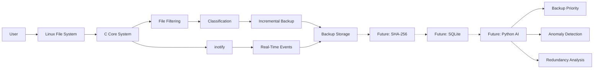

---

# ▶️ How to Run

### 1. Open the project directory

```bash
cd ~/intelligent-file-backup-system
```

### 2. Compile

```bash
gcc main.c -o backup_system
```

### 3. Run

```bash
./backup_system
```

The program asks:

```text
Enter minimum modification date (YYYY-MM-DD):
```

Example:

```text
2026-09-09
```

After the initial backup:

```text
========================================
REAL-TIME FILE MONITORING STARTED
========================================
```

The program will continue monitoring the source directory.

Press:

```text
Ctrl + C
```

to stop monitoring.

---

# 📋 Current Feature Status

| Feature                            | Status    |
| ---------------------------------- | --------- |
| 📂 Initial Directory Scanning      | ✅         |
| 📅 Date Filtering                  | ✅         |
| 👻 Hidden File Filtering           | ✅         |
| 🗂️ Extension-Based Classification | ✅         |
| 💾 Full Backup                     | ✅         |
| 🔄 Incremental Backup              | ✅         |
| 📦 Low-Level File Copy             | ✅         |
| ⚡ Real-Time Monitoring             | ✅         |
| ➕ CREATE Detection                 | ✅         |
| ✏️ MODIFY Detection                | ✅         |
| 🗑️ DELETE Detection               | ✅         |
| 📥 MOVE IN Detection               | ✅         |
| 📤 MOVE OUT Detection              | ✅         |
| 🗑️ Delete Backup Removal          | 🔜        |
| 📤 Move-Out Backup Removal         | 🔜        |
| ♻️ SHA-256 Deduplication           | 🔜        |
| 🗄️ SQLite Metadata                | 🔜        |
| 🤖 AI Analysis                     | 🔜        |
| 📊 GUI                             | 🔮 Future |

---

# 🔮 Future Enhancements

* ♻️ Content-based file deduplication
* 🗄️ SQLite metadata management
* ♻️ File restore functionality
* 📝 Backup history and logging
* 🗜️ File compression
* 🔐 Backup encryption
* 📊 Backup statistics
* ⭐ Intelligent project-folder prioritization
* 🚨 AI-based anomaly detection
* 🤖 AI-based backup priority
* ♻️ Smart redundancy analysis
* 🖥️ Graphical User Interface

---

# 🎯 Project Progress

### Phase 1 — Core Linux Backup ✅

```text
Directory Scanning
       ↓
Hidden File Filtering
       ↓
Date Filtering
       ↓
File Classification
       ↓
Incremental Backup
       ↓
Low-Level File Copy
```

### Phase 2 — Real-Time Monitoring ✅

```text
inotify
   │
   ├── CREATE    → Automatic Backup
   ├── MODIFY    → Automatic Backup
   ├── MOVE IN   → Automatic Backup
   ├── DELETE    → Detection
   └── MOVE OUT  → Detection
```

### Phase 3 — Deduplication 🔜

```text
File
 ↓
SHA-256 Hash
 ↓
Compare Hash
 ↓
Duplicate?
 ├── YES → Mark Duplicate
 └── NO  → Store Hash
```

### Phase 4 — SQLite 🔜

```text
File Metadata
      ↓
Backup Information
      ↓
File Hashes
      ↓
Activity Data
      ↓
SQLite Database
```

### Phase 5 — AI 🔜

```text
SQLite
   ↓
Python
   ↓
Machine Learning
   │
   ├──→ Backup Priority
   ├──→ Anomaly Detection
   └──→ Redundancy Analysis
```

---

# ⭐ Project in One Line

```text
Linux + C + inotify + Backup + Classification
                    ↓
       SHA-256 + SQLite + AI
                    ↓
     🔐 Intelligent File Management
```

---

# 👥 For the Team

```text
WHAT WE HAVE
     ↓
C + Linux
     ↓
Backup + Filtering
     ↓
File Classification
     ↓
Incremental Backup
     ↓
inotify Monitoring
     ↓
WHAT WE BUILD NEXT
     ↓
SHA-256 Deduplication
     ↓
SQLite
     ↓
Python + AI
```

> **Core principle:** First build a reliable Linux backup system, then add deduplication, database management, and AI intelligence step by step.
