# 🔐 Intelligent File Backup & Management System

> **A Linux-based intelligent file management system for automated backup, real-time monitoring, duplicate detection, file classification, and AI-based analysis.**


---

## 🎯 Project Objective

Build a **local, offline Linux system** that automatically:

* 💾 Performs full and incremental backups
* 👀 Monitors file activity in real time
* 🗂️ Classifies files by type
* ⭐ Prioritizes important project folders
* ♻️ Detects duplicate and redundant files
* 🤖 Uses AI for intelligent backup and anomaly analysis

### Development Phases

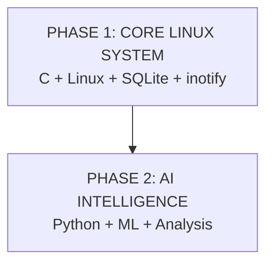

---

# 🏗️ System Architecture

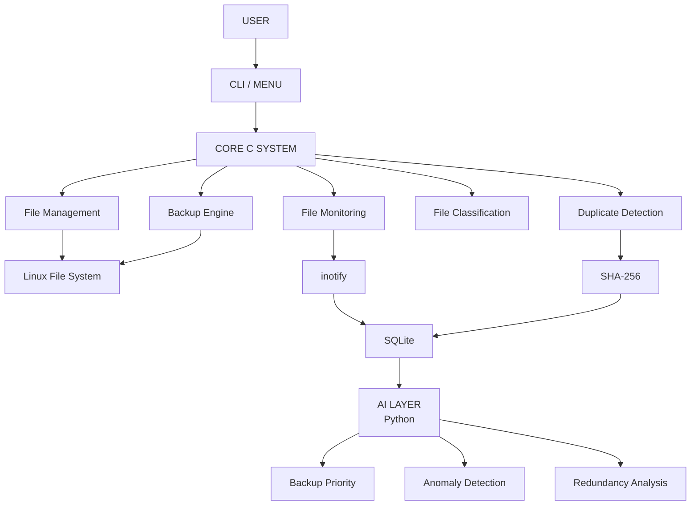

---

# ⚙️ Core Modules

| Module                 | Function                                                  |
| ---------------------- | --------------------------------------------------------- |
| 📁 File Manager        | Create, read, write, copy, move and delete files          |
| 💾 Full Backup         | Initial backup of all selected files                      |
| 🔄 Incremental Backup  | Backup only new or modified files                         |
| 👀 Monitoring          | Detect file creation, modification, deletion and movement |
| 🗂️ Classification     | Categorize files by extension                             |
| ⭐ Project Registry     | Mark important folders as high priority                   |
| ♻️ Duplicate Detection | Detect identical files using SHA-256                      |
| 🗄️ SQLite             | Store file and backup metadata                            |
| 🤖 AI Layer            | Analyze backup priority, anomalies and redundancy         |

---

# 💾 Backup Flow

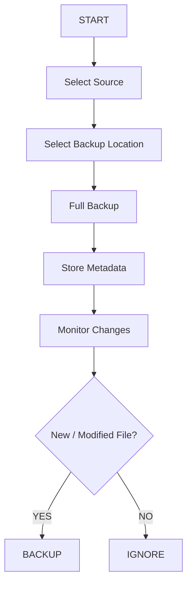

### Backup Types

| Type                   | Description                       |
| ---------------------- | --------------------------------- |
| **Full Backup**        | Copies all selected files         |
| **Incremental Backup** | Copies only new or modified files |
| **Restore**            | Recovers files from backup        |

---

# 👀 Real-Time File Monitoring

The system uses Linux **`inotify`** to monitor selected directories.

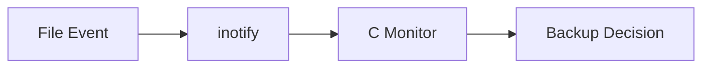

### Monitored Events

```text
CREATE
MODIFY
DELETE
MOVE
```

---

# 🗂️ File Classification

Files are categorized according to their extensions.

| Extension               | Category      |
| ----------------------- | ------------- |
| `.pdf`                  | PDF Document  |
| `.docx`                 | Word Document |
| `.pptx`                 | Presentation  |
| `.xlsx`                 | Spreadsheet   |
| `.jpg`, `.jpeg`, `.png` | Image         |
| `.xml`                  | XML / Data    |
| `.txt`                  | Text          |
| `.c`                    | Source Code   |
| Unknown                 | Other         |

### Classification Flow

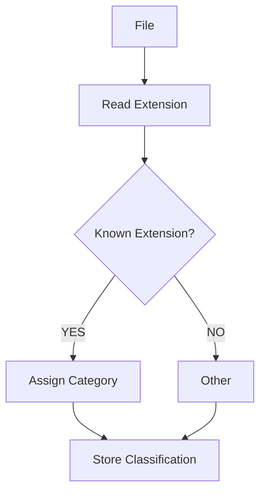

---

# ⭐ Project Folder Registry

Users can mark important folders for special treatment.

```text
/home/user/Projects/OS_Project
/home/user/Projects/Final_Year_Project
```

| Setting          | Value   |
| ---------------- | ------- |
| Priority         | HIGH    |
| Backup Frequency | HIGH    |
| Monitoring       | ENABLED |

---

# ♻️ Duplicate Detection

Exact duplicate files are detected using **SHA-256 hashes**.

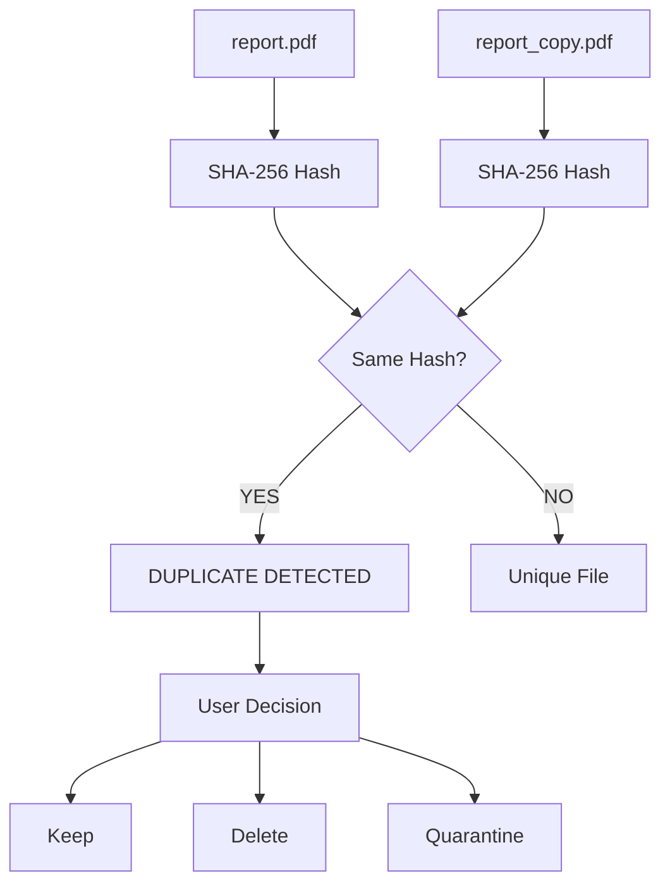

> ⚠️ Files are not automatically deleted.

---

# 📏 Rule-Based Backup Decision

Before AI is introduced, predefined rules are used.

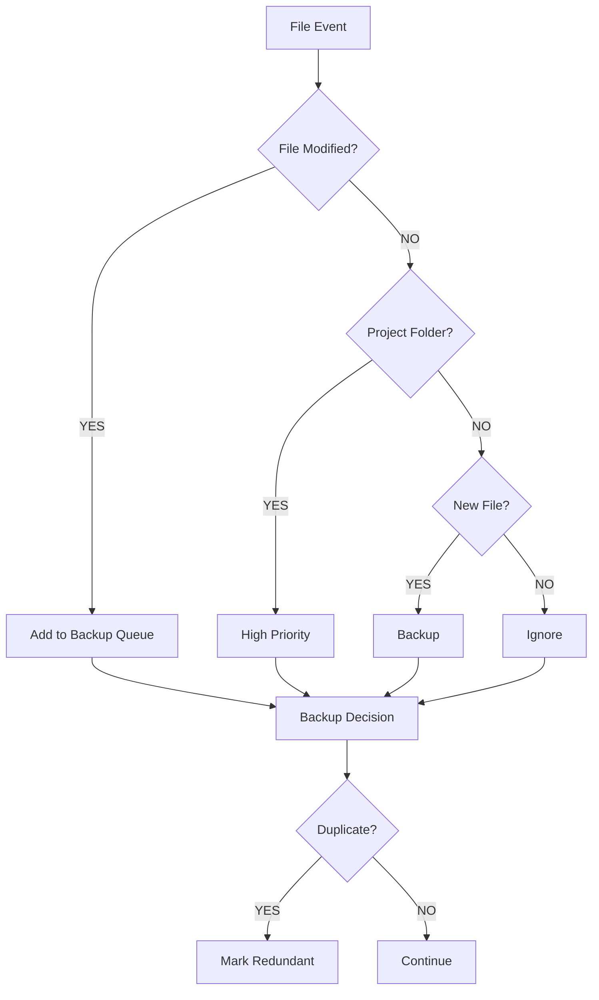

```text
IF file is modified
        ↓
Add to backup queue

IF file belongs to project folder
        ↓
High priority

IF file is newly created
        ↓
Backup

IF file is unchanged
        ↓
Ignore

IF duplicate detected
        ↓
Mark redundant
```

---

# 🤖 AI Layer

The AI layer is added after the core system is functional.

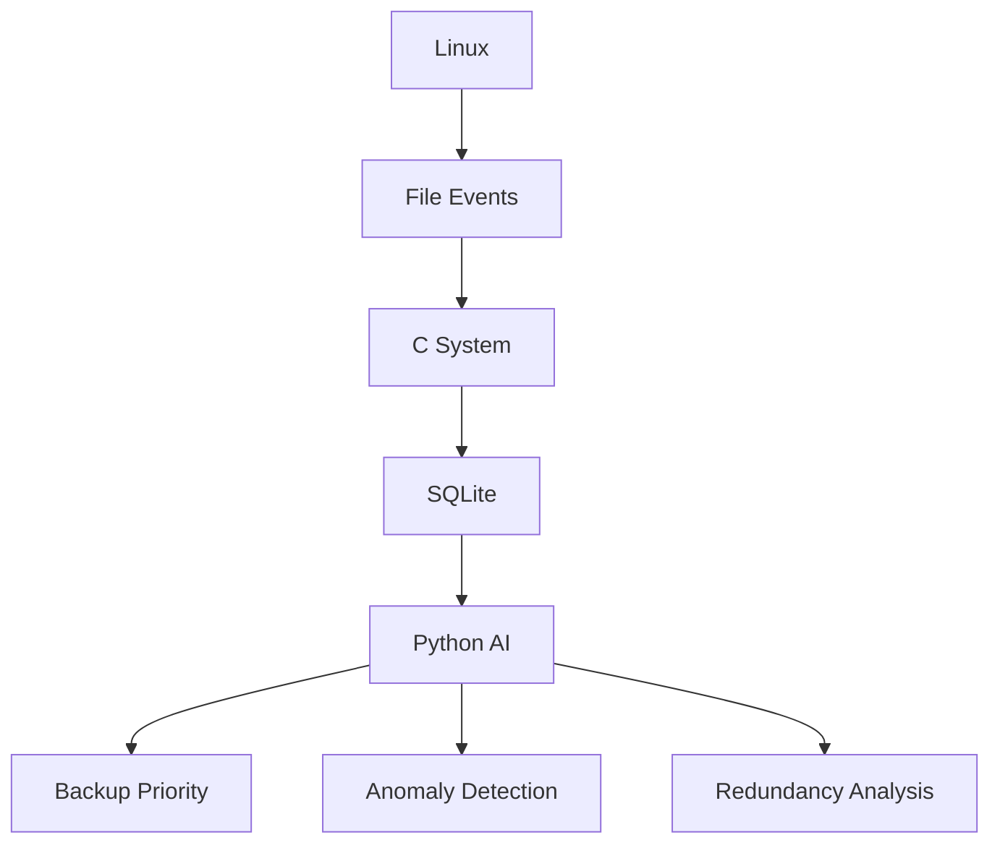

### AI Features

| Feature                | Purpose                              |
| ---------------------- | ------------------------------------ |
| 🧠 Backup Priority     | Identify important files             |
| 🚨 Anomaly Detection   | Detect unusual file activity         |
| ♻️ Redundancy Analysis | Identify potentially redundant files |

---

# 🧠 Intelligent Backup Priority

AI analyzes:

* File access frequency
* Modification frequency
* Last usage
* Project-folder status
* File type
* Previous backup history

### Example

```text
main.c

Access Count: 100
Modification Count: 40
Project Folder: YES

Result:
Importance = HIGH
Backup Priority = HIGH
```

---

# 🚨 Anomaly Detection

### Normal Activity

```text
20–30 files/day
Normal access hours
Regular file modifications
```

### Unusual Activity

```text
Hundreds of files modified rapidly
Large number of file changes
Unusual activity pattern
```

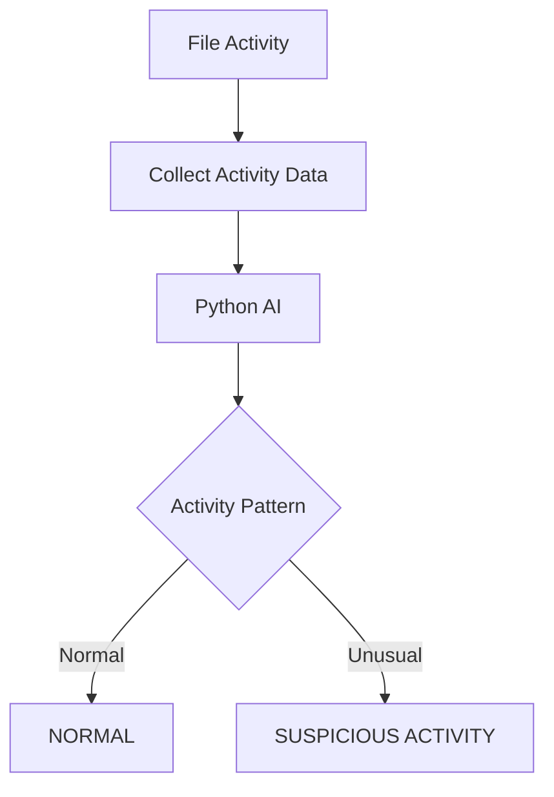

Output:

```text
NORMAL
   OR
SUSPICIOUS ACTIVITY
```

---

# ♻️ Smart Redundancy Analysis

AI can analyze:

```text
Similar file names
Usage frequency
File age
File type
Content similarity (future improvement)
```

Example:

```text
report_final.pdf
report_final_copy.pdf
report_final_v2.pdf
```

These files can be flagged as **potentially redundant** for user review.

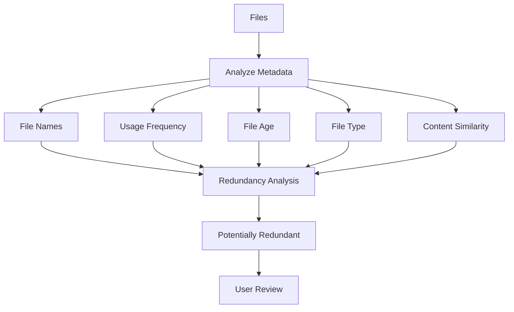

---

# 🛠️ Technology Stack

| Component         | Technology                 |
| ----------------- | -------------------------- |
| Operating System  | Linux / Ubuntu             |
| Core Language     | C                          |
| Linux Integration | POSIX / Linux System Calls |
| File Monitoring   | inotify                    |
| Database          | SQLite                     |
| Hashing           | SHA-256                    |
| AI Language       | Python                     |
| Machine Learning  | Scikit-learn               |
| Data Processing   | Pandas / NumPy             |
| Interface         | Command Line               |
| Version Control   | Git / GitHub               |

---

# 📂 Project Structure

```text
intelligent-file-backup-system/
│
├── src/
│   ├── main.c
│   ├── file_manager/
│   ├── backup/
│   ├── monitoring/
│   └── redundancy/
│
├── database/
│   ├── schema.sql
│   └── system.db
│
├── ai/
│   ├── backup_priority.py
│   ├── anomaly_detection.py
│   └── redundancy_analysis.py
│
├── backups/
├── test_files/
│
├── README.md
└── Makefile
```

### Architecture Overview


---

# 📊 Evaluation Metrics

| Metric         | Objective                |
| -------------- | ------------------------ |
| Backup Size    | Reduce storage           |
| Backup Time    | Reduce backup time       |
| Restore Time   | Enable fast recovery     |
| I/O Overhead   | Minimize unnecessary I/O |
| Detection Rate | Detect unusual behavior  |

### Full vs Incremental Backup

| Feature      | Full Backup | Incremental Backup |
| ------------ | ----------- | ------------------ |
| Files Copied | All         | New / Modified     |
| Storage      | High        | Low                |
| Time         | High        | Lower              |
| I/O          | High        | Optimized          |

---

# 🔄 Complete System Flow

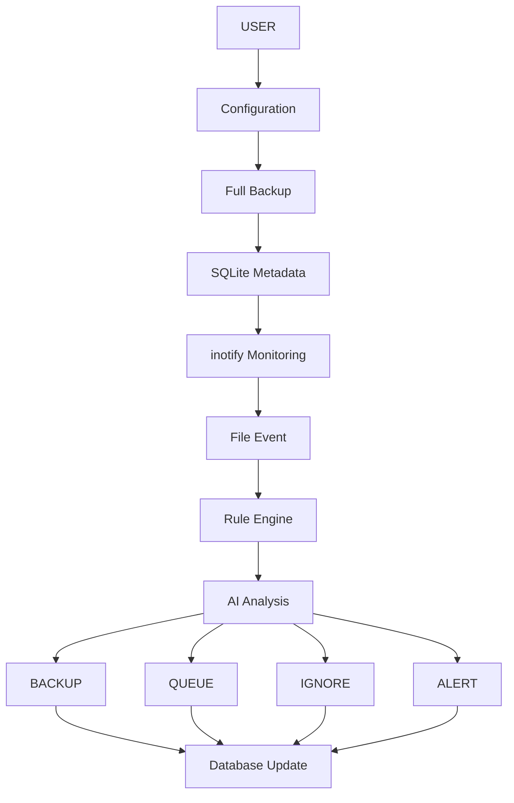

```text
USER
 │
 ▼
Configuration
 │
 ▼
Full Backup
 │
 ▼
SQLite Metadata
 │
 ▼
inotify Monitoring
 │
 ▼
File Event
 │
 ▼
Rule Engine
 │
 ▼
AI Analysis
 │
 ├──→ BACKUP
 ├──→ QUEUE
 ├──→ IGNORE
 └──→ ALERT
 │
 ▼
Database Update
```

---

# 🔗 Overall System Pipeline

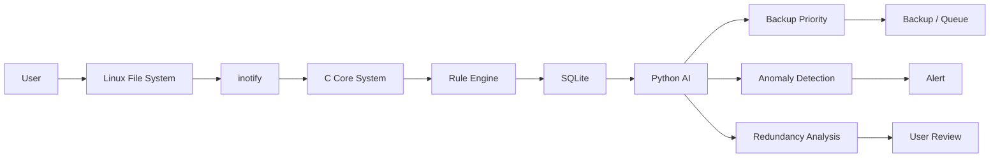

---

# ⭐ Project in One Line

```text
Linux + C + inotify + SQLite + Backup + SHA-256 + AI
                         ↓
          🔐 Intelligent File Management
```
